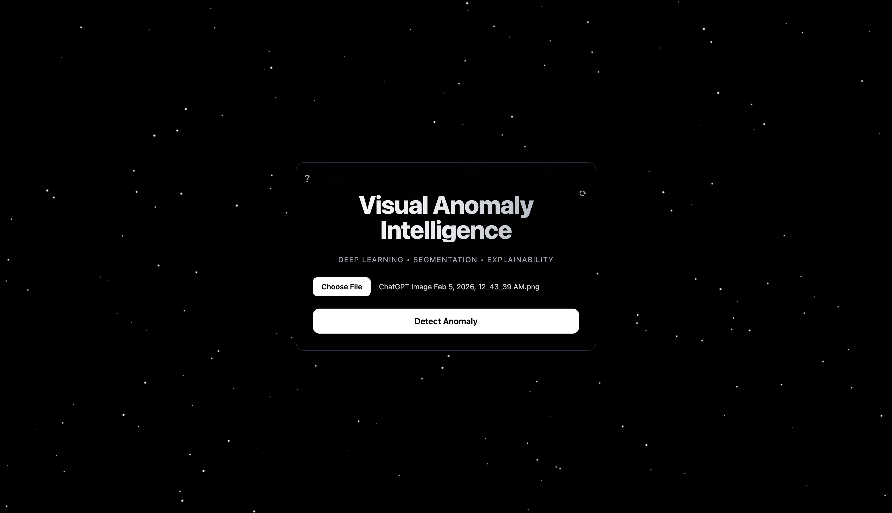
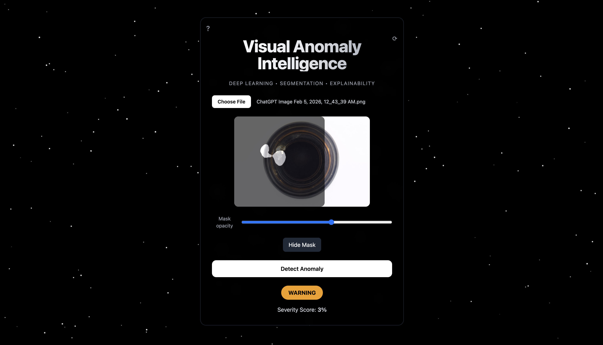
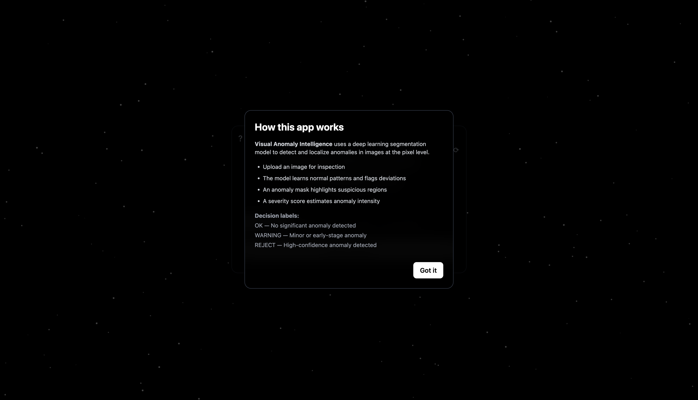

# 🔍 Visual Anomaly Intelligence

A full-stack deep learning application for **pixel-level anomaly detection and localization** in images using semantic segmentation.

Built with a **U-Net–based deep learning model**, deployed via **FastAPI**, and visualized through a **React + Tailwind** interactive frontend with explainability controls.

---

## ✨ Key Features

- 🧠 Deep Learning–based anomaly **segmentation**
- 🎯 Pixel-level **defect localization**
- 📊 Severity scoring with decision labels (OK / WARNING / REJECT)
- 🎚 Explainability via mask overlay & opacity control
- 🌌 Interactive starry background (space-mesh effect)
- 🔄 Reset workflow & built-in user guide
- ⚡ Real-time inference using FastAPI

---

## 🏗 Tech Stack

### Backend
- Python
- TensorFlow
- OpenCV
- FastAPI
- U-Net (Encoder–Decoder architecture)

### Frontend
- React (Vite)
- Tailwind CSS
- HTML5 Canvas

---

## 🧪 How It Works

1. User uploads an image
2. Backend processes the image using a U-Net segmentation model
3. Pixel-level anomaly mask is generated
4. Severity score is computed
5. Results are returned and visualized in the UI

---

## 📸 Demo Preview

### Landing Interface


### Anomaly Detection & Localization


### Built-in User Guide


---

## 🚀 Getting Started

### 1️⃣ Clone the Repository

```bash
git clone https://github.com/aryanjadhav2006/visual-anomaly-localization.git
cd visual-anomaly-localization

### 2️⃣ Backend Setup

```bash
cd backend/app
python3 -m venv venv
source venv/bin/activate
pip install --upgrade pip
pip install -r requirements.txt
uvicorn main:app --reload

Backend runs at:

http://127.0.0.1:8000


API documentation:

http://127.0.0.1:8000/docs

### 3️⃣ Frontend Setup

Open a new terminal:

cd frontend
npm install
npm run dev


Frontend runs at:

http://localhost:5173

---

### ▶️ How to Use the Application

1 Open the frontend in your browser

2 Upload an image

3 Click Detect Anomaly

4 View:

    * Anomaly segmentation mask

    *  Severity score

    *  Decision label

5 Adjust mask opacity for explainability

6 Use Reset to analyze another image

7 Click ? to open the user guide